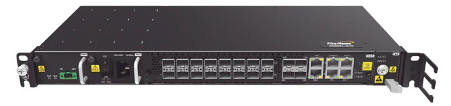

<h1 align="center">😁 COMANDOS 😁</h1>

<!-- huawei ne40e -->
<h4>Hauwei NE40E</h4>

    

<!-- fiberhome an6001 -->
  
<h4>Fiberhome an6001</h4>

    

<!-- fiberhome an6001 -->
  
<h4>Huawei MA5800-X7</h4>

    

