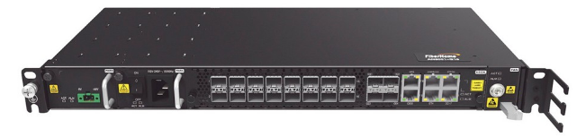

<h1 align="center">Comando básicos -> FiberHome AN6001-G1</h1>

<h1 align="center">
  
</h1>

## ◾ Criar vlan de gerencia
	manage-vlan GERENCIA svlan 4000

## ◾ Adicionar a vlan de gerencia na porta de uplink
	port vlan 4000 untag 1/19 3

## ◾ Adicionar ip na vlan
	manage-vlan ipv4 GERENCIA 192.168.216.2/24

## ◾ Criar rota
	static-route destination-ip 0.0.0.0 mask 0.0.0.0 nexthop 192.168.216.1

## ◾ Criar uma vlan de serviço
	service-vlan DADOS 71 type data

## ◾ Criar varias vlan's de serviço
	service-vlan DADOS 71 to 86 type data

## ◾ Adicionar vlan na porta uplink
	port vlan 71 tag 1/19 3

## ◾ Adicionar varias vlans na porta uplink
	port vlan 71 to 86 tag 1/19 3

## ◾ Adicionar uma vlan nos SLOT's
	port vlan 73 allslot

## ◾ Adicionar varias vlan's nos SLOT's
	port vlan 73 to 86 allslot

## ◾ Salvar configurações automaticamente
### Salvar a cada 360 minutos
	autosave on 360

### Salvar a cada 24h
	autosave on 19:00:00