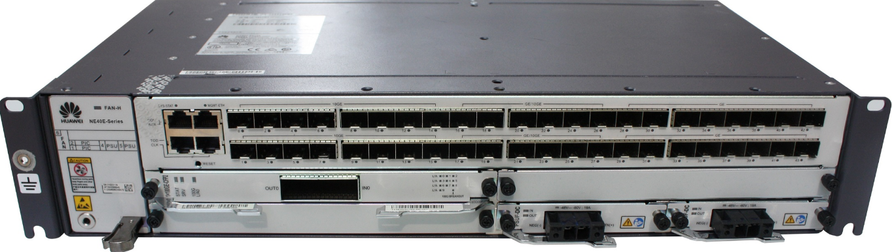

<h1 align="center">😁 Comando básicos -> Huaweu NE40E</h1>

<h4 align="center">
  🚧 OPS!! Em construção... 🚧
</h4>

<h1 align="center">
  
</h1>

## ◾ CHANGE PASSWORD - MUDAR SENHA
    - aaa
    - local-user root password cipher {SENHA}
    - commit

## ◾ AMUDAR PORTA SSH - CHANGE SSH PORT
    ssh server port {PORTA}

## ◾ CRIAÇÃO DE ROTAS ESTÁTICAS - STATIC ROUTES
    ip route-static ** <ip do cliente> ** 32 <ip do concentrador> description {descrição}

## 